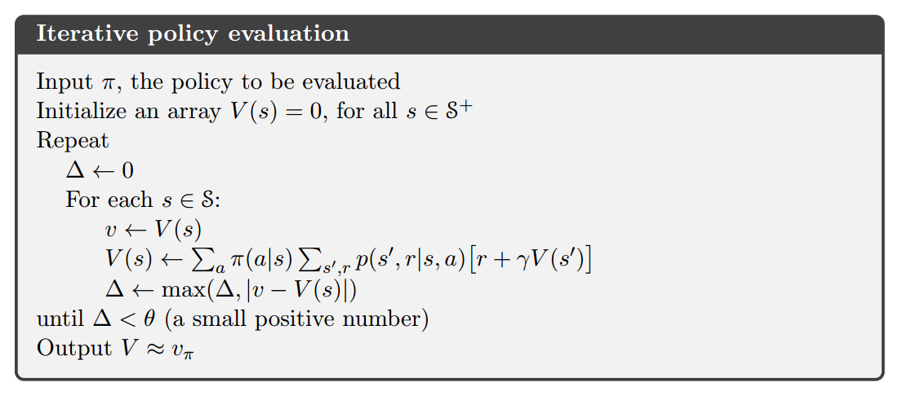
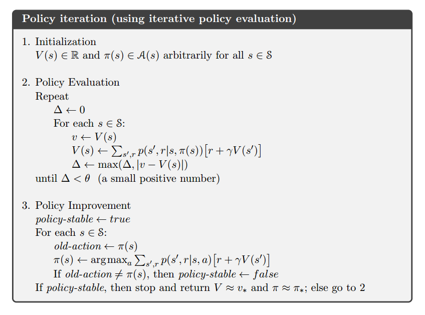
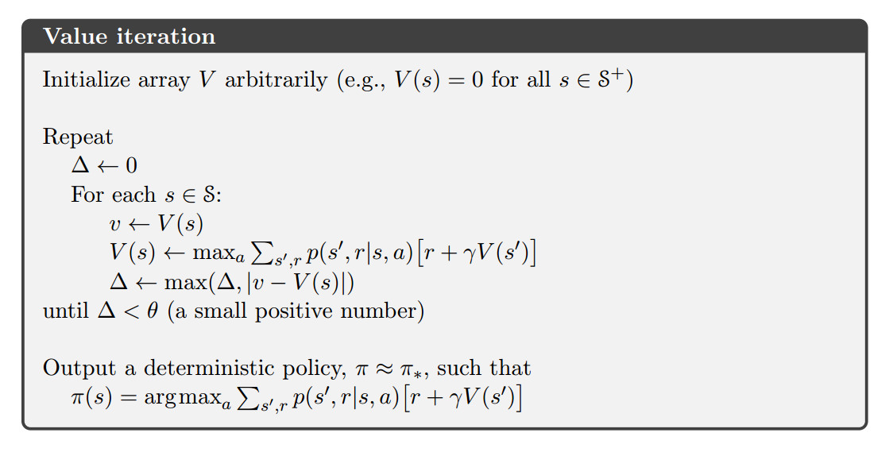
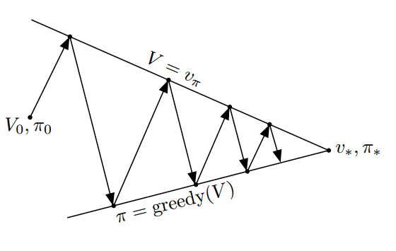

# Dynamic Programming

* Book Name: Reinforcement Learning: An Introduction
* Authors: Richard S.Sutton, Andrew G.Barto
* Version: Second edition, 2016
* Chapter 4

DP algorithm are obtained by turning Bellman equaltions into update rules for improving *approximations* of the desired value functions.

## Policy Evaluation
Policy Evaluation: given a policy $\pi$, we compute the value functions for this policy.

The existence and uniqueness of $v_\pi$ ($q_\pi$) are guaranteed as long as either $\gamma \leq 1$ or this task is episodic(I'm not sure if my understanding is correct. See book.).

$$
\begin{align}
v_\pi(s)&=\sum_a\pi(a|s)\sum_{s',r|s,a}p(s',r|s,a)[r+\gamma v_\pi(s')]\\
q_\pi(s,a)&=\sum_{s',r}p(s',r|s,a)(r+\gamma\sum_{a'}\pi(a'|s')v_\pi(s',a'))
\end{align}
$$

We have above Bellman equations. If the dynamic of environment is completely known, then we actually have a series of linear equations. We can solver them by linear programming, for example.

Iterative Policy Evaluation: we use the right part of equation to update the left part. The sequence $\{v_k (q_k)\}$ will finally converge to the true value function.

Full Backup: All backups, such as in DP, are based on all possible next states rather than on sampled next states.

### Algorithm: Iterative Policy Evaluation
NOTICE: We always use in-place version algorithm whenever it ensure correctness. It is usually faster, besides. We usually pick state-value function as example. But it is similar for action-value function.

Termination of algorithm:

* obtain small differences (see $\Delta$) between successive estimations.
* exceed an upper bound of the number of iterations.

## Policy Improvement

How could we obtain a better policy $\pi '$ from current policy $\pi$, given its value function? (We think about policies that are deterministic without lose of generality: we can always find a deterministic optimal policy. It may not optimal for the real world problem but it is optimal theoretically to the MDP. Besides the following Policy Improvement Theorem carries through for the stochastic case.)

Policy Improvement Theorem:
Let $\pi',\pi$ be deterministic policies, if
$$
q_\pi(s,\pi'(s))\geq v_\pi(s)
$$
for all $s\in S$, then
$$
v_{\pi'}(s)\geq v_\pi(s)
$$
for all $s\in S$. Namely $\pi'$ is a better policy than $\pi$. If the inequality is satisfied strictly at any（任何一个） state in the condition, then the inequality would be satisfied at at least one state in the result.

The proof of this theorem is rather easy. We can simply expand $q_\pi$ repeatly.

A natual choice for $\pi'$ is the *greedy* policy w.r.t the value function of $\pi$.

$$
\pi'(s)=\mathop{\arg\max}_a q_\pi(s,a)\quad (1)
$$

for all $s \in S$. This process is called *policy improvement*.

If we have $v_{\pi'}(s)= v_\pi(s)$, then $v_\pi(s)=\max_aq_\pi(s,a)$, which is the same as Bellman optimality equation. So, both $\pi'$ and $\pi$ are optimal policies.

> Policy improvement this must give us a strictly better policy except when the original policy is already optimal.

For the stochastic case, each maximizing action can be given a portion of the probability of being selected in the new greedy policy, when there is a tie appearing in
(1).

## Policy Iteration
Policy Iteration:
repeat

* policy evaluation
* policy imporvement

until policy conveges (unchanges).

## Value Iteration: a Special Case of Policy Iteration

We can truncate the policy evaluation to only one sweep, instead of waiting value function to converge. The final convergence of policy is still guaranteed.

Then we have a simple backup operation that combines the policy improvement and trucated policy evaluation steps:
$$
  v_{k+1}(s)\leftarrow \mathop{\max}_a\sum_{s',r}p(s',r|s,a)\{r+\gamma v_k(s')\}
$$

This update rule can also be understood by referencing to the Bellman optimality equation.

Besides, this update rule is identical to the one of policy evaluation except that it requires the maximum to be taken over all actions.

Termination: the same as policy evaluation.

Truncated policy iteration algorithm (including value iteration) combines multiple sweeps in policy evaluation and one sweep of policy improvement.

## Asynchronous Dynamic Programming
Asynchronous DP are in-place iterative DP that are not organized in terms of systematic sweeps of the state set.
A crucial requirement of convergence is that the algorithm must continue to backup the values of all the states.

> It allows great flexibility in selecting states to which backup operations are applied. For example, we can focus the backups onto parts of the state sets that are most relavant to the agent.

## Generalized Policy Iteration & Efficiency of Dynamic Programming
Generalized Policy Iteration: the general idea of letting policy evaluation and policy improvement processes interact, independent of the granularity and other details of the two processes.

DP algorithm can usually handle much more states (by a factor of 100) than correponding linear programming.
Futher, in Problems with large state spaces, asynchronous DP methods are often preferred.

Bootstrapping: updating estimates on the basis of other estimates.
