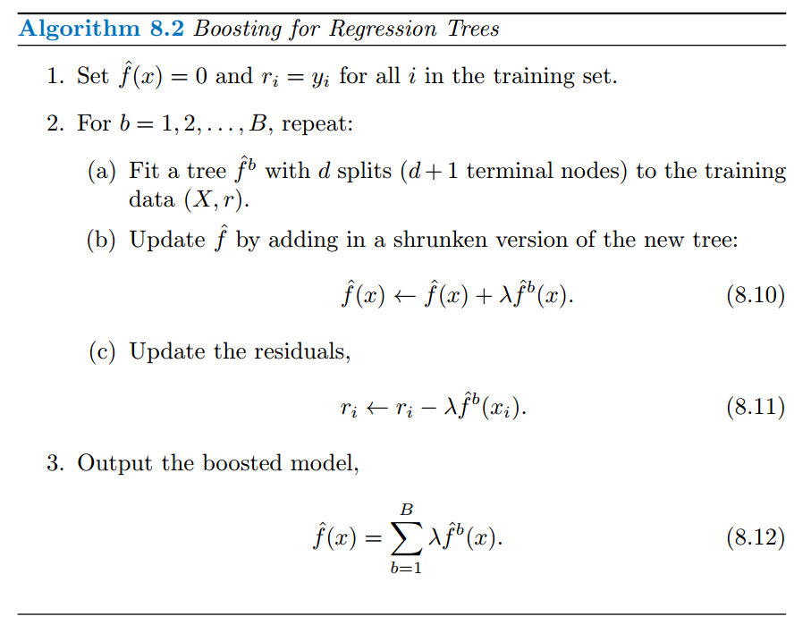

# Tree-Based Methods
## Decision Tree
Divide the feature space into multiple regions. Assign each region a value (mean value for regression)/label (majority label for classification).

Construction:
* Binary Split to build an internal nodes. We always split at a feature leading to the most increase in some metrics.
    * Continuous Predictor
    * Discrete Predictor
* Stop when the number of nodes in a region is smaller than a threshold, e.g. 5 observations.
* Pruning (Regularization)
    * Pre-pruning: Stop futher spliting if increase in some metric is smaller than a threshold
    * Post-pruning: Collapse internal nodes to minimize the modified objective = the original objective + $\alpha|T|$, after a large tree is constuctured. (Here, we talk about Cost Complexity Pruning)
### Regression Tree
Train:
* Minimize Mean Square Error

Valid:
* Mean Square Error

### Classification Tree
Train:
* Minimize Gini Index or Entropy, which are capable of evaluating purity of a distribution

Valid:
* Classification Error Rate

### Compared with Linear Models
Advantage:
* Even more interpretable
* Can handle non-linear mapping
* Mirror human's decision making

Disadvantage:
* Not robust. For slightly different datasets, different trees may be constructed.
* Generally not accurate as those linear models.

## Bagging
Sample several subsets from training dataset. Learn a tree for each subset. Combine predictions from those trees. Those tree can grow deep without being pruned.

Bagging will not result in *overfitting*.

### Bootstrapping
### Out-of-Bag Error Estimation
### Variable Importance

## Random Forest
As bagging, we build multiple trees on bootstrapped training subset.

At each split, sample $m$ features out of total $p$ features and restrict the spliting only happens at those features. The core idea here is to decorrelate multiple trees. If features are more correlated, we should pick smaller $m$.

Bagging is a special case with $m=p$.

No *overfitting*.

## Boosting
We construct the current tree based on the residual error resulted from the previously construcred trees.

The algorithm can be described as follows:

Tunable Parameters:

1. The shrinkage parameter $\lambda$, a small positive number, controlling the rate at which boosting learns. A small $\lambda$ requires more trees to achieve good performance.
2. d splits (d=1 could work well: a stump leads to an additive model). d is the *interaction depth*, controling the interaction between variables (Involving at most d variables.). Small d is sufficient.
3. B trees (may overfit, even slowly)

### GDBT
### XGBOOST

> Boosting and Bagging are general approaches that can be applied to many statiscal methods.
